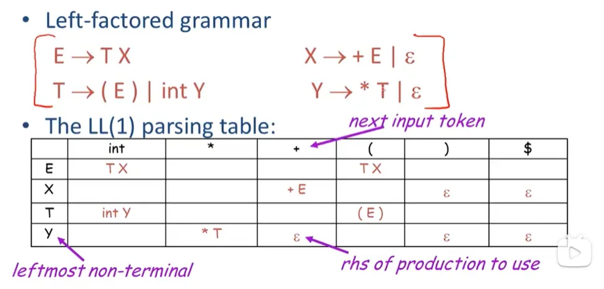
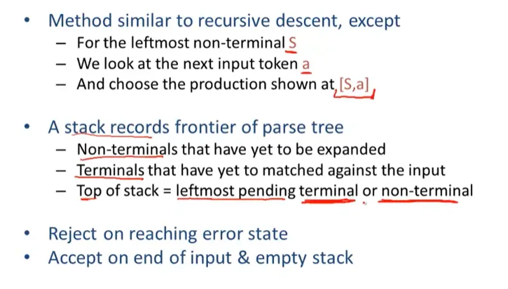
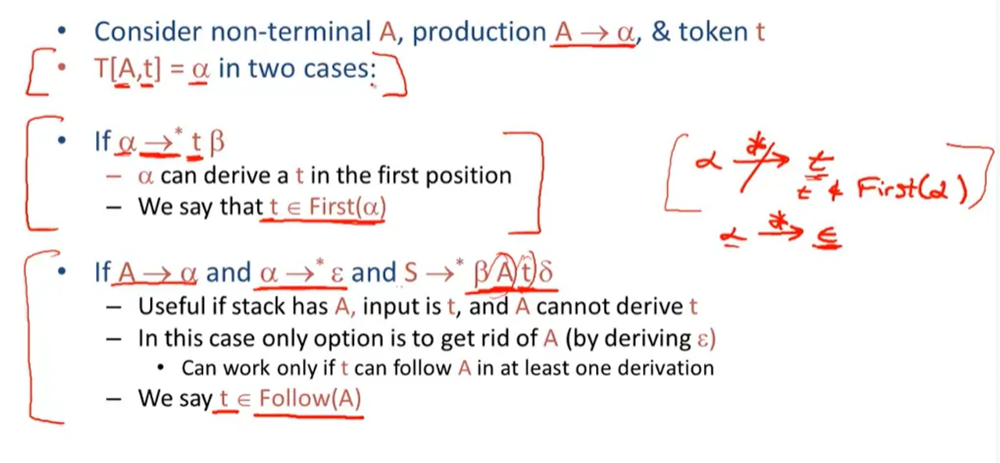
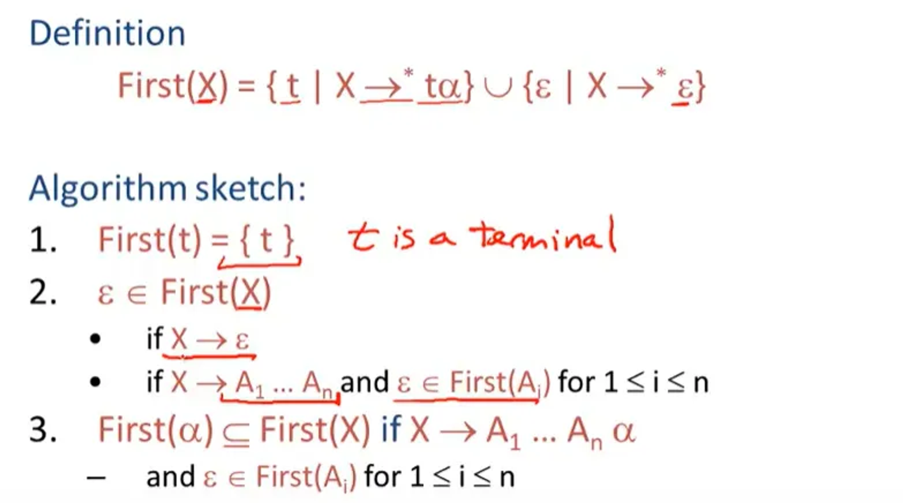
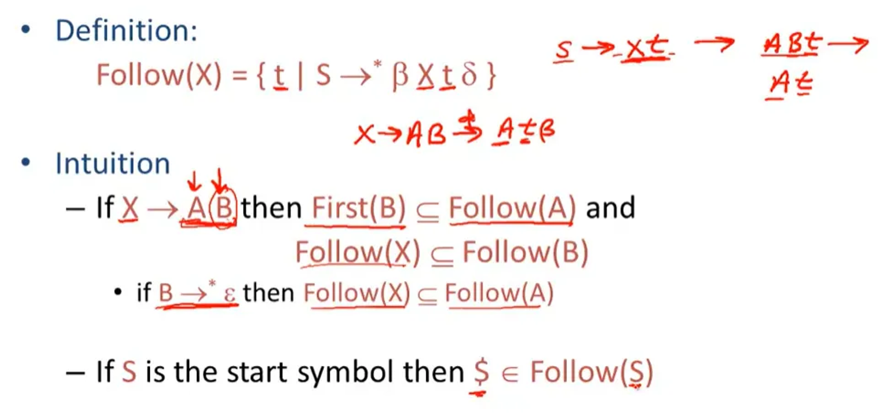
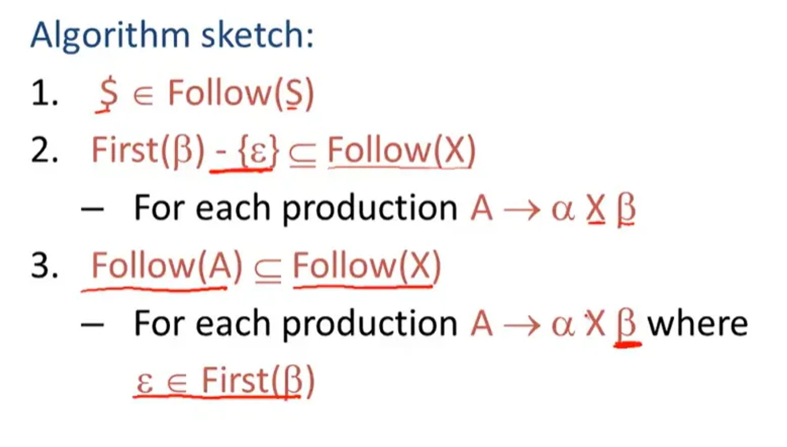
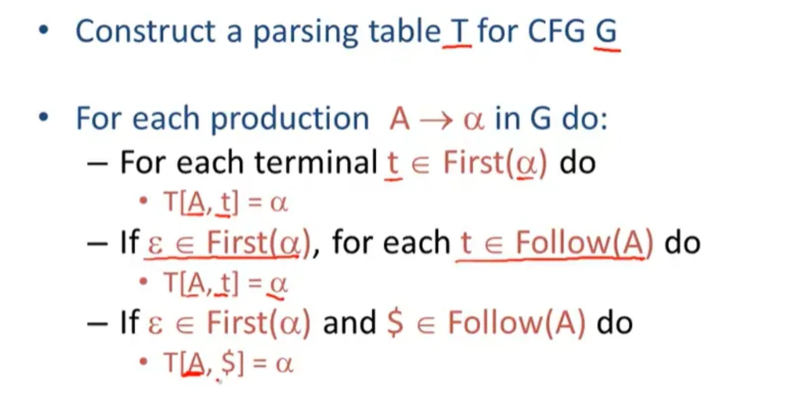

# LL1 Parser

这是作者在复习编译器相关知识时，为了充分理解LL1算法而编写的代码。

**LL(*)分析：是一种处理某些上下文无关文法的自顶向下分析器。**

为什么叫做自顶向下？

因为它**从左到右处理输入**，并对句型执行**最左推导**（left derivation）出语法树。这样生成的语法树从根节点一直延伸到叶子节点。

一个 LL 分析器若被称为 LL(*k*) 分析器，表示它使用 *k* 个[词法单元](https://zh.wikipedia.org/w/index.php?title=%E8%AF%8D%E6%B3%95%E5%8D%95%E5%85%83&action=edit&redlink=1)作[向前探查](https://zh.wikipedia.org/w/index.php?title=%E5%90%91%E5%89%8D%E6%8E%A2%E6%9F%A5&action=edit&redlink=1)（即每次执行最左推导时选取k个词法单元）。对于某个文法，若存在一个分析器可以在不用[回溯法](https://zh.wikipedia.org/wiki/%E5%9B%9E%E6%BA%AF%E6%B3%95)进行[回溯](https://zh.wikipedia.org/wiki/%E5%9B%9E%E6%BA%AF)的情况下处理该文法，则称该文法为 **LL(*k*) 文法**。这些文法中，较严格的 **LL(1) 文法**相当受欢迎，因为它的分析器只需多看一个词法单元就可以产生分析结果。那些需要很大的 *k* 才能产生分析结果的[编程语言](https://zh.wikipedia.org/wiki/%E7%BC%96%E7%A8%8B%E8%AF%AD%E8%A8%80)，在分析时的要求也比较高。因为 k 作为每一层遍历的次数将带来 k^n 级别的计算量爆炸。

在实际实现时，会先将文法改写成语法分析表 parsing table。


当我们看到leftmost的符号S，要找最左推导使用的产生式时，直接看[S,a]对应的产生式。本质上是因为只有一个产生式能通过S的推导得到a。


如何构建parsing table呢？

核心是找非终结符在最左推导时能直接对应到哪些终结符。分两种情况：

第一种情况是 A 本身可以通过 $A\rightarrow\alpha$ 和 $\alpha\rightarrow^* t\beta$ 得到以 t 为首的句型。这种情况下，t 在 $\alpha$ 的 first 集合中。核心: 在同一个 production 里，non-terminal 之后的 first terminal 可能是什么。

第二种情况是虽然 t 不在 $\alpha$ 的 first 集合中，但 A 最后能得到 $\epsilon$，而 S 有产生式能够让 A 后面紧挨着 t。这样就可以把 A 去除掉，这时因为 t 在 A 的后面，所以 t 在 A 的 follow 集中。核心：跨 production 场景。non-terminal 是一个 production 的结束，他的下一个 terminal 可能是什么。



这个过程的可视化：

https://jsmachines.sourceforge.net/machines/ll1.html

https://www.cs.princeton.edu/courses/archive/spring20/cos320/LL1/







Follow(A) 是 Follow($\beta$) 的子集是因为别的生成式右侧能接在 A 后面的东西，在一步推导后一定可以接在 $\beta$ 后。
比如 S→AX, A→aXb,
S⇒AX⇒aXbX
因此能接在 A 后面的，一定会接在 b 后面。所以 Follow(A) 是 Follow(b) 的子集。Follow(b) 应该将 Follow(A) 合并进来。但如何保证此时 Follow(A) 已经生成好了呢？直接调用递归然后用记忆化来降低复杂度。

得到first和follow集合后，通过遍历这两个集合可以得到parsing table:


实际实现中由于要记录产生式的具体形式，所以可以在构建firsts时就构建一部分parsing table。

具体逻辑是：每当一个符号s的firsts计算完成后就更新这部分的table。

```
for first in firsts[s]:
	parsing_table[s][first] =  current_production
```

等follow构建完后，因为follow能够参与到parsing table的前提是对应非终结符的firsts中有$\epsilon$，伪代码为：
```
for 非终结符s in symbols:
	if epsi in firsts[s]:
		for 终结符t in follows[s]:
			// 为了最终能得到t，说明s这一步要得到epsi
			parsing_table[s][t] = parsing_table[s][epsi]
```

firsts和follow的构建逻辑参考：

https://gist.github.com/DmitrySoshnikov/924ceefb1784b30c5ca6

这是作者在网上为数不多的开源实现中看到的比较易懂的版本。